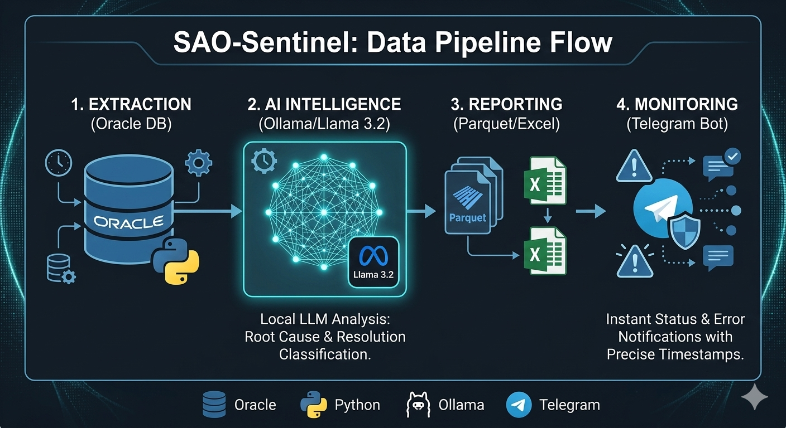

# 🛡️ SAO Flow AI 

**SAO Flow AI** is a comprehensive analytical reporting automation system. It bridges the gap between enterprise Oracle databases and the power of local Large Language Models (LLMs) via Ollama, providing smart data classification and instant Telegram notifications.



###✨ Key Features
* **Automated Pipeline: End-to-end workflow from Oracle extraction to Excel/Parquet generation.
* **AI Integration: Leverages Ollama (Llama 3.2) for intelligent support ticket analysis.
* **Smart Notifications: Real-time Telegram alerts for task status and errors.
* **Docker Ready: Seamless deployment in isolated Linux environments.

### 🛠️ Quick Start
1. Clone the repository.
2. Prepare your .env file based on .env.example.
3. Run using Docker Compose:

   ```bash
    docker-compose up -d --build
   
### 📁 Project Structure
* **pipeline.py — Main orchestrator.
* **notifier.py — Telegram API integration.
* **superapp_ai.py — LLM processing logic.
* **database.py — Secure Oracle DB connection.


**SAO Flow AI** — это умный конвейер данных, который автоматизирует рутинную аналитику:

## Краткое описание архитектуры
* **Автоматизированный Pipeline**: Сбор данных из Oracle DB.
* **AI-Аналитика**: Локальный анализ текстов с помощью ИИ (Ollama).
* **Smart Notifications**: Генерация отчетов и уведомление в Telegram.
* **Контейнеризация**: Полная поддержка Docker для развертывания в закрытом контуре.

### 🛠️ Быстрый старт
1. Склонируйте репозиторий.
2. Создайте файл `.env` на основе `.env.example`.
3. Запустите проект:
   ```bash
   docker-compose up -d --build
   

### .env.example   
# База данных Oracle
DB_HOST=10.xx.xx.xx
DB_PORT=1521
DB_SERVICE=your_service_name
DB_USER=your_username
DB_PASS=your_password

# Настройки Telegram
TELEGRAM_TOKEN=123456789:ABCDEFG...
TELEGRAM_CHAT_ID=-100123456789

# Пути и модели
REPORTS_PATH=/mnt/reports/2026
AI_MODEL=llama3.2:3b
OLLAMA_URL=http://localhost:11434/api/generate

# Настройки выгрузки (через запятую)
TARGET_TEH="Group1, Group2, Group3"